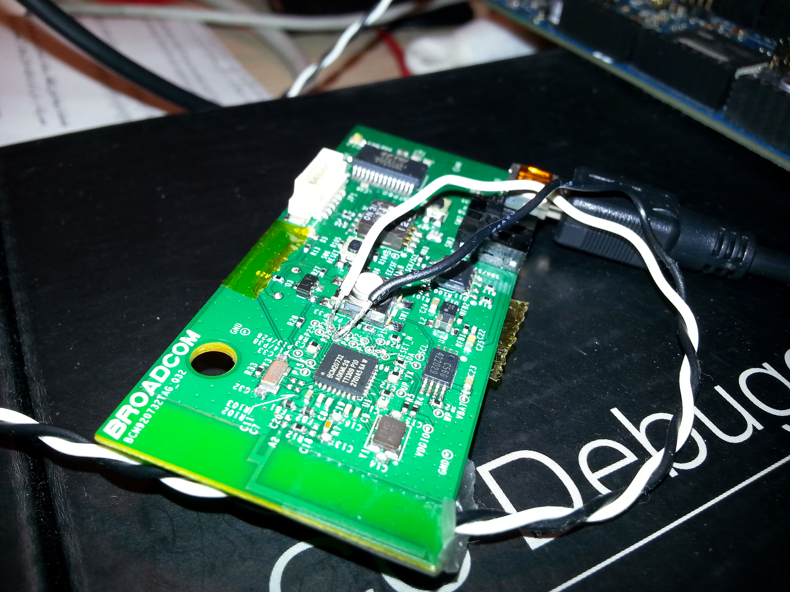
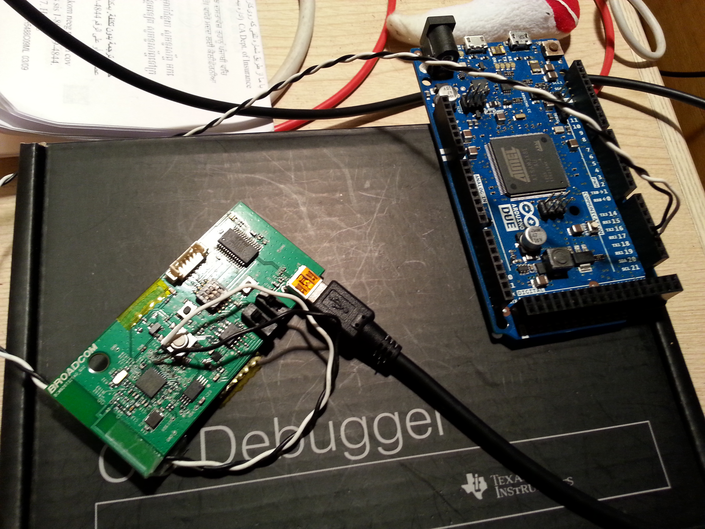

DrumPants Bluetooth LE Firmware
================================================

This is firmware for a MIDI over Bluetooth LE device. It accepts MIDI messages from the UART and sends them over the air according to the Apple MIDI over BLE spec. 

Written for the Broadcom BCM2073X module, used in the DrumPants wearable musical instrument. It is designed as a reference for creating your own wireless MIDI instrument.

http://www.drumpants.com

For the main DrumPants MCU firmware, see http://developers.drumpants.com

Features
--------------------------

* Connects to a separate MCU (such as an Arduino) and accepts commands and MIDI messages.
* Speed-optimized MIDI parser adds timestamps required by MIDI over BLE spec.
* Connection interval negotiation/subterfuge: the master device sends a request to the BLE chip to set the connection interval to a mode compatible with the master device. Good for selecting the fastest interval based on iOS/Android version and device model/type.
* Many bug fixes and workarounds for connecting/pairing to Android devices successfully.

Installation
=======================

Requires the Broadcom WICED SDK 2.2.0.

1. Install as a module in the apps directory of the WICED SDK (or just copy it into the `hello_sensor` app directory (backup first!)).
2. Create a new make target for it (or use the existing `hello_sensor` target).
3. Double click the target to install to your dev board. For installing to DrumPants, additional steps are needed (see next section)

Production Builds
-------------------------

*IMPORTANT*: To disable debug printing for production builds, add this to the end of your make target:

`GCC_FLAGS="-DBLE_TRACE_DISABLE"`

If you do not, the code will be very slow and may miss notes or experience extreme latency/lag.

Upload to DrumPants
-------------------------

Uploading to DrumPants is a complex process. The BLE module is only accessible through the DrumPants MCU, so we need to upload USB-to-UART bridge firmware to the DrumPants MCU. Then, you can use the Broadcom IDE to upload the BLE firmware *through* the DrumPants MCU, like your computer was connected directly to the BLE module. 

The easiest way to do this is to use the DrumPants desktop app to upload the USB-to-UART bridge:

1. Download the DrumPants 2.0 app (step 1 of these instructions: http://drumpants.uservoice.com/knowledgebase/articles/566124)
2. Run the DrumPants app in factory firmware uploader mode:
  * 2a. *Mac OSX*: In Terminal, cd to your Applications directory and run `./DrumPants.app/Contents/MacOS/DrumPants --updater`
  * 2b. *Windows*: (Not tested.) Run `DrumPants.exe --updater`.
3. The Firmware uploader window should appear.
4. Check the "BLE Bridge Only" box.
5. Connect your DrumPants, turn them on, and proceed with uploading the firmware.
6. If successful, the DrumPants LED should only show two dots.
7. You can now access the Broadcom BLE module as if it was directly connected to your USB port:
8. Open the Broadcom WICED IDE.
9. Double click the make target to upload the BLE firmware from the last section. It may take several tries, and you may have to turn the DrumPants off and back on again before uploading.
10. Once the BLE firmware is uploaded, you can now replace the MCU's temporary USB-to-UART bridge firmware with the actual DrumPants Sensorizer firmware:
  * 10a. Via the DrumPants updater: Select "Basic Kit" as the kit type, uncheck "BLE Bridge Only", and upload. (Basic kit mode will not re-upload the BLE firmware).
  * 10b. Via the Arduino IDE: https://github.com/DrumPants/Sensorizer-DrumPants-Firmware
11. The USB-to-UART bridge is designed to reset into bootloader mode via Arduino's standard method: opening/closing the port at 1200bps. If for some reason this does not work, you can manually trigger a reset by pressing the Volume Up button on the DrumPants. If *that* doesn't work, follow the Reset and Erase instructions in the DrumPants Sensorizer readme.

Debugging
-------------------------

You can view the debug traces from the BLE module through the DrumPants MCU's USB connection.

1. Open the DrumPants Sensorizer firmware: https://github.com/DrumPants/Sensorizer-DrumPants-Firmware
2. In the `Debug.h` file, change both `ENABLE_DEBUG_PRINTING` and `ENABLE_DEBUG_PRINTING_RELAY_FROM_BLE` to `1`.
3. Upload the DrumPants sensorizer firmware with the Arduino IDE as detailed in its README.
4. Open the Serial Monitor in the Arduino IDE; you should see debug messages from the BLE chip as well as the main MCU.

Bug Reporting / Contributing
==========================

Please file a Github issue for any questions, suggestions, or bugs. 

Pull requests welcome! Please associate with a related Issue if possible.

Broadcom Dev Board Notes
=======================

An example of how to use the peripheral UART on a Broadcom BCM20732 Bluetooth Low Energy module using the Wiced Smart SDK. 

The function of note is `onUARTReceive()` in hello_sensor.c: that's your callback whenever the UART receives data.

Note this is a very simple implementation to prove that it works. You'll probably want to buffer the UART according to your application's needs.

Derived by Tyler Freeman from sample code in the "Wiced Smart Interfaces" PDF, page 15.

Soldering
-------------

The BCM920732TAG dev board doesn't come with jumpers to the PUART, so you'll need to do some ninja soldering:

There are some breakout pads near the BLE module on the board: 

* P32 - TX
* P33 - RX

This of course can be configured differently, but those are the defaults of GPIO_PIN_UART_TX and GPIO_PIN_UART_RX.

Connected to an Arduino DUE:

Building
-----------------

You can build it without using Eclipse. Just run

C:\Users\tyler\Documents\WICED\WICED-Smart-SDK-1.1.0\WICED-Smart-SDK>make.exe RAM.hello_sensor-BCM920732TAG_Q32 download UART=COM4

License
==========================

Files are marked with their respective copyright owners and licenses.

The MIDI parser and the modifiations to the `hello_sensor` files are copyright 2011-2015 DrumPants, Inc.

http://www.drumpants.com

Licensed under the Apache License, Version 2.0 (the "License");
you may not use this file except in compliance with the License.
You may obtain a copy of the License at

    http://www.apache.org/licenses/LICENSE-2.0

Unless required by applicable law or agreed to in writing, software
distributed under the License is distributed on an "AS IS" BASIS,
WITHOUT WARRANTIES OR CONDITIONS OF ANY KIND, either express or implied.
See the License for the specific language governing permissions and
limitations under the License.

**Other code is copyright by their respective owners and may not fall under the open source license.**
